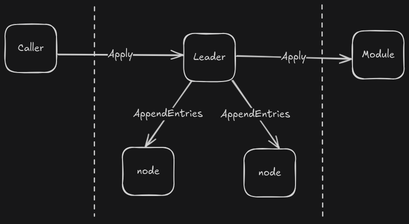

# Tiny Raft

A raft built with server and transport modules only. 

Bring your own state machine.

## Install

Currently only a package level import is supported. Other entrypoints are planned for future development. Currently you can install using command:

```bash
go get github.com/trevatk/tinyraft
```

## Quick Start

```golang

// required env variables
// also found in the Makefile
//
// NODE_ID="00000000-0000-0000-0000-000000000000"
// NODE_ADVERTISE_ADDR=":50051"
// NODE_LISTEN_ADDR=":50051"
// RAFT_BOOTSTRAP="true"
// RAFT_DATA_DIR="data/00000000-0000-0000-0000-000000000000"

type wordTracker struct {
	mtx   sync.Mutex
	words []string
}

// interface compliance
// raft leader will call Apply when new entries are added
var _ tinyraft.Module = (*wordTracker)(nil)

// Apply module implementation when receiving log payload from raft
func (wt *wordTracker) Apply(cmd []byte) error {
	wt.mtx.Lock()
	defer wt.mtx.Unlock()

	w := string(cmd)
	wt.words = append(wt.words, w)
	return nil
}
```

Full [Example](./examples/raft.go)

## Design

From a high level perspective there are three objects used to create, start/stop, and interact with the raft `Caller`, `Raft`, and `Module`. 

### Caller

Client side interaction with the raft. From the `examples/raft.go` a client side `gRPC` call is made to `apply` a command to the raft. Essentially calling to the raft leader and telling it to apply the command to all nodes. Arriving at name `caller`. left side of `figure1-1`.

### Raft

This is the `raft` itself responsible for replicating commands across all nodes. 

### Module



## Terminology

`Caller` : `client` implementation. Should be used to interact with your `raft`. Uses `gRPC` policies to `wait-for-ready` and `retry`.  

`Module` : used by `raft.Server` to implementation module wrapper.

`Server` : server side implementation to be used with existing `server` code. `Start` and `Shutdown` should be with application lifecyle code.

`State Machine` : storage of log entries. NOT INCLUDED.

## References

- [hashicorp/raft](https://github.com/hashicorp/raft)
- [raft consensus](https://raft.github.io/raft.pdf)
- [raft gRPC](https://github.com/Jille/raft-grpc-example)